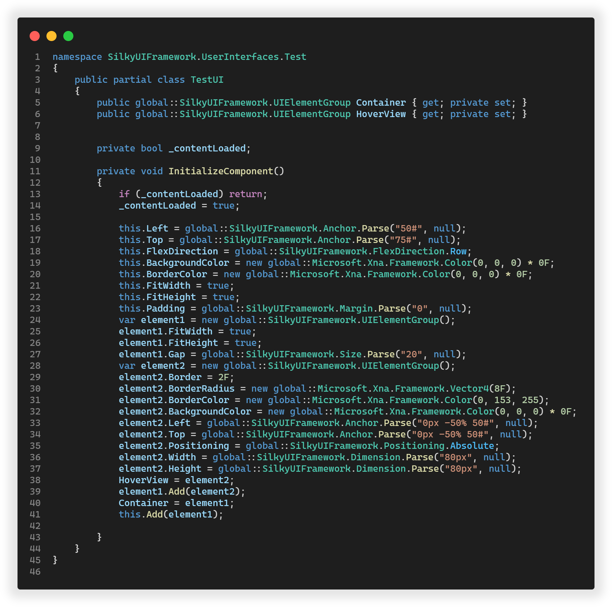

# SilkyUI 框架分析器

SilkyUI Framework 项目分析与代码生成器\
可以将 UI 的 XML 结构描述转换为 C# 代码

## 特殊元素

### Style 元素

定义通用样式，`Style` 元素的 `Name` 属性为此样式的名称\
遇到重复 Name 的以首个 `Style` 元素为准\
使用 `Style` 时，将需要元素的 `Style` 属性设置为对应 `Style` 的 `Name` 即可\
普通元素的 `Style` 属性可以填写多个 `Style`，多个 `Style` 之间用空格隔开

## 特殊属性

### Class 属性

在根元素使用，填写 C# 类的全限定名称。

### Name 属性

会在类中创建一个类的属性，然后将此XML元素映射到类的属性。
随后你可以通过此属性操作 UI 元素