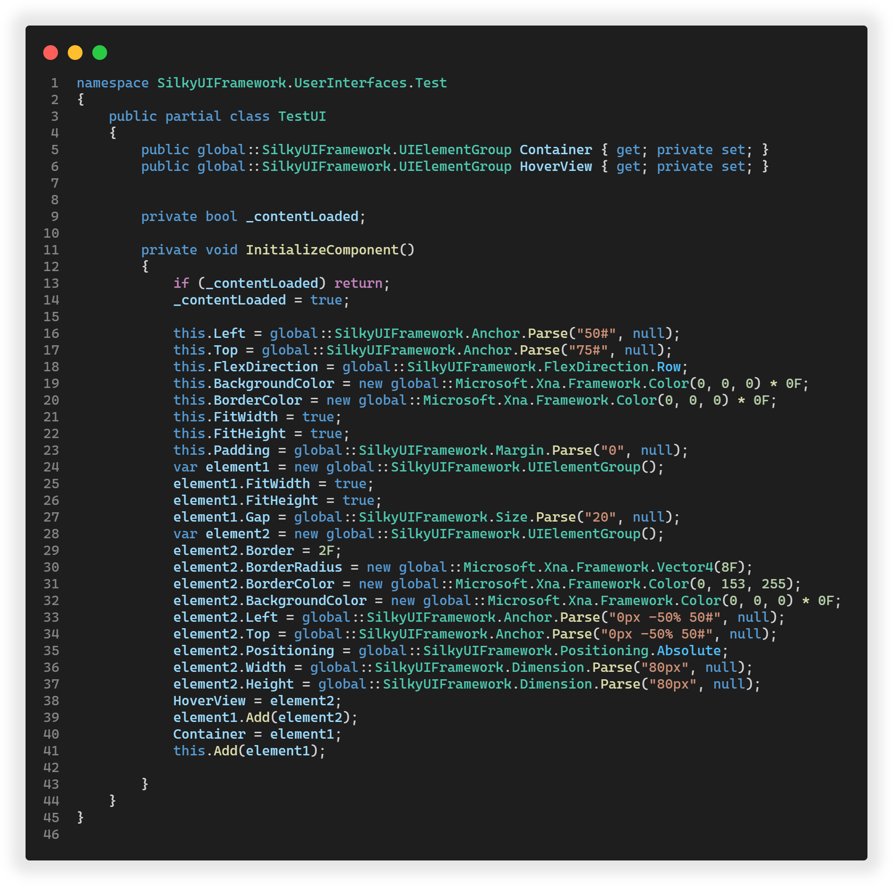

# SilkyUI 框架分析器

SilkyUI Framework 项目分析与代码生成器\
可以将 UI 的 XML 结构描述转换为 C# 代码



## XML 文件

UI 文件使用 `.sui.xml` 后缀，并作为 `AdditionalFiles` 提供给生成器。
在根元素声明 `xmlns:sui="https://github.com/487666123/SilkyUIFramework"`；需要绑定时再声明 `xmlns:bind="https://github.com/487666123/SilkyUIFramework/Binding"`，
通过 `sui:Class` 指定继承 `UIElementGroup` 的 C# 类的全限定名称。
`sui` 和 `bind` 前缀都可以替换，命名空间 URI 必须保持一致。

## 特殊元素

### sui:Style 元素

定义通用样式，`sui:Style` 元素的 `sui:Name` 属性为此样式的名称。
样式属性直接写在该元素上；无前缀属性（包括 `Name`）都会作为样式属性参与赋值。
样式名称和普通样式属性职责分离，避免与控件的 `Name` 属性冲突。

```xml
<Body xmlns:sui="https://github.com/487666123/SilkyUIFramework"
      sui:Class="MyMod.MyPanel"
      sui:Style="BasePanel">
    <sui:Style sui:Name="BasePanel" Name="PanelName" Width="300" Height="200" />
</Body>
```

示例中的 `MyMod.MyPanel` 需要替换为实际组件类名，样式属性需要对应目标控件的可写属性。
遇到重复 `sui:Name` 时以首个样式定义为准。
元素通过 `sui:Style="BasePanel"` 引用样式，多个样式名称用空格隔开。
同名静态属性以后面的样式为准，元素直接声明的静态属性覆盖样式中的静态属性。
`bind:*` 绑定优先于同名静态属性赋值；绑定命名空间 URI 是 `https://github.com/487666123/SilkyUIFramework/Binding`。
不再使用 `<Text Value="Hello" />` 这样的子元素定义样式属性。

## 特殊属性

### sui:Class 属性

在根元素使用，填写 C# 类的全限定名称。

### sui:Name 属性

会在类中创建一个类的属性，然后将此XML元素映射到类的属性。
随后你可以通过此属性操作 UI 元素

### bind:* 属性

`bind:Text="Title"` 把数据源的 `Title` 绑定到控件的 `Text` 属性。`bind:` 前缀可以替换，必须绑定到 Binding URI；绑定属性名需要手写或使用 VSIX 补全。

```xml
<Body xmlns:sui="https://github.com/487666123/SilkyUIFramework"
      xmlns:bind="https://github.com/487666123/SilkyUIFramework/Binding"
      sui:Class="MyMod.MyPanel">
    <Panel bind:Text="Title" />
</Body>
```

### M. 前缀元素

以 `M.` 开头的元素（如 `M.Mask`、`M.Container`）表示目标对象的成员属性。
分析器会将这些元素视为父元素对应属性的子元素进行初始化，适用于嵌套属性设置。
